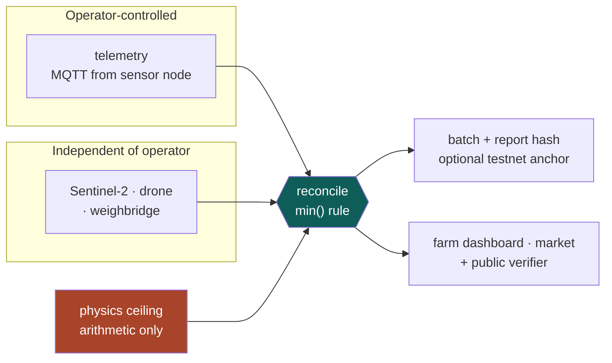

<div align="center">

# AlgaCarbon

**Making a carbon claim checkable.**

Verification platform for algae-based carbon sequestration.
Team **RunTimeZero** — HackOut'26, Circular Carbon Ecosystem.

### ▶ [algacarbon.itzzsuperrr.me](https://algacarbon.itzzsuperrr.me)

[](https://algacarbon.itzzsuperrr.me)
[](https://github.com/Daksh2477/RunTimeZero/actions/workflows/ci.yml)

</div>

**Jump to:** [The idea](#the-problem) · [Run it on your laptop](#run-it-on-your-laptop) ·
[Demo walkthrough](#demo-walkthrough) · [Troubleshooting](#troubleshooting) ·
[How it fits together](#how-it-fits-together)

---

## The problem

Algae eat CO₂ as they grow. If you can prove how much they ate, you can sell carbon credits.

**Nobody can currently prove it.** The farm operator reports their own numbers and the verifier has
no independent way to check them. Roughly **23%** of credits retired in the voluntary market in 2024
were judged unlikely to deliver, and across a meta-analysis of nearly a billion tonnes, **fewer than
16%** of credits from investigated projects represented real reductions.

**Not one major carbon fraud involved a tampered registry.** The records were accurate. The inputs
were false.

## What we do about it

We compute a second estimate from evidence the operator cannot touch — satellite imagery, a public
weighbridge ticket, and the physics of how much sunlight landed on that pond — and then:

```
creditable = min(claimed, independent_lower_bound, physics_ceiling)
```

Claim 100 t where the evidence supports 60–140 t → **you get 60 t.**
Claim 150 t where the evidence supports 60–140 t → **you also get 60 t.**
Claim above what physics allows → **rejected outright.**

There is no number an operator can type that yields more credits than the evidence supports, so
**lying gains you nothing**. Erring low is deliberate: this market's failure is over-crediting. The
way to earn more is better evidence (a weighbridge gives ±10% where satellite gives ±2.4×).

Around that core sits a working marketplace: operators list verified credits and harvested algae,
buyers retire credits and order produce, investors find farms to fund, and every money view shows
build cost, running cost, revenue and profit in rupees.

---

## Run it on your laptop

Works on **macOS** (Apple Silicon or Intel), **Linux**, and **Windows through WSL2**. Setup takes
about 15 minutes, most of it installing Rust.

### What you need

| Tool | Version | Why |
|---|---|---|
| Node.js | **22.6 or newer** | API, web app and scripts (TypeScript runs directly via `--experimental-strip-types`) |
| PostgreSQL | 14 or newer | All data. Uses the bundled `pgcrypto` extension |
| Rust + `wasm-pack` | stable | Builds the physics engine to WebAssembly. The API will not start without it |
| Internet | — | Telemetry travels over the public MQTT broker `broker.hivemq.com` (or run your own, see [offline](#no-internet--use-a-local-mqtt-broker)) |

Python is **not** needed. The trained models ship as JSON in `packages/models/artifacts`.

### 1. Install the tools

<details open>
<summary><b>macOS (Homebrew)</b></summary>

```bash
# Homebrew itself, if you don't have it: https://brew.sh
brew install node@22 postgresql@16
brew link --force node@22            # so `node -v` prints v22.x
brew services start postgresql@16    # runs Postgres in the background

# Rust and wasm-pack
curl --proto '=https' --tlsv1.2 -sSf https://sh.rustup.rs | sh -s -- -y
source "$HOME/.cargo/env"
rustup target add wasm32-unknown-unknown
brew install wasm-pack               # or: cargo install wasm-pack
```

Homebrew's Postgres already trusts your macOS user, with no password, over a socket in `/tmp`.
[Postgres.app](https://postgresapp.com) works the same way if you prefer it.
</details>

<details>
<summary><b>Ubuntu / Debian</b></summary>

```bash
# Node 22 via fnm (or nvm, or NodeSource)
curl -fsSL https://fnm.vercel.app/install | bash
source ~/.bashrc && fnm install 22 && fnm use 22

sudo apt install -y postgresql build-essential
sudo -u postgres createuser -s "$USER"   # lets your login user create databases

curl --proto '=https' --tlsv1.2 -sSf https://sh.rustup.rs | sh -s -- -y
source "$HOME/.cargo/env"
rustup target add wasm32-unknown-unknown
cargo install wasm-pack
```
</details>

<details>
<summary><b>Windows</b></summary>

Install WSL2 (`wsl --install` in an admin PowerShell, then reboot), open the **Ubuntu** app, and
follow the Ubuntu steps above inside it. Clone the repo inside WSL (`~/`), not under `/mnt/c`, or
file watching and installs are very slow. Open `http://localhost:3000` in your normal Windows
browser; WSL forwards the ports.
</details>

Check:

```bash
node -v          # v22.6.0 or newer
psql --version
wasm-pack --version
```

### 2. Get the code and install packages

```bash
git clone https://github.com/Daksh2477/RunTimeZero.git
cd RunTimeZero
npm install
npm run physics:build        # Rust → WASM, ~1–3 min the first time
```

### 3. Configure

```bash
cp .env.example .env
```

Open `.env` and set these three lines:

```bash
# macOS (Homebrew or Postgres.app): socket lives in /tmp
DATABASE_URL=postgresql:///algacarbon?host=/tmp
# Linux / WSL: socket lives in /var/run/postgresql (this is the default in .env.example)
# DATABASE_URL=postgresql:///algacarbon?host=/var/run/postgresql

# Any long random string. Without it, every API restart signs everyone out.
AUTH_SECRET=paste-output-of-openssl-rand-hex-32

# Everyone running this project shares one public broker. A private topic keeps
# other people's simulators out of your dashboard.
MQTT_TOPIC_PREFIX=rtz/yourname/pond
```

Generate the secret with `openssl rand -hex 32`. Everything else in `.env` is optional:
Copernicus keys add real satellite thumbnails, and the `CHAIN_*` keys anchor batches on a testnet
(see [`docs/DEPLOY-CHAIN.md`](docs/DEPLOY-CHAIN.md)). Without them the app says so plainly rather
than faking it.

### 4. Create and fill the database

Run these once, in this order. Each finishes in a second or two.

```bash
createdb algacarbon
set -a; source .env; set +a      # load DATABASE_URL into this shell for psql

npm run db:setup       # tables
npm run db:seed        # 4 farms, 7 ponds, across all four evidence tiers
npm run replay         # 14 days of sensor history + independent evidence
npm run db:expenses    # operating expense ledger derived from that history
npm run db:account     # admin / admin
npm run db:market      # 8 demo accounts, produce orders, investor listings
```

You should see `done: 4 sites, 7 ponds`, `replayed 14 days across 7 ponds`, and
`accounts: naroda-ops, … / demo1234`.

### 5. Start it

Use two terminal tabs, both in the repo folder:

```bash
# Tab 1 — API on http://localhost:4000
npm run api
```

Wait for `[api] listening on :4000` and `[mqtt] connected`.

```bash
# Tab 2 — web app on http://localhost:3000
npm run dev --workspace=apps/web
```

Open **http://localhost:3000**. Check the API with `curl localhost:4000/health` → `{"ok":true,"db":true}`.

### 6. Optional: live sensor data

The seeded history is enough to click around. For readings that arrive while you watch (and to
break a pond on purpose), start the pond simulator in a third tab while the API is running:

```bash
# Tab 3 — simulated sensor nodes publishing over MQTT
npm run sim -- --speed 1 --backdate 75
```

`--speed 1` publishes one simulated hour per pond every second, so readings move on screen and a
full day-night cycle takes 24 seconds. `--backdate 75` starts 75 days back, which gives about 30
minutes of continuous data before it reaches the present and slows to one reading per real hour.
Don't use high speeds like 48 or 200: the public broker drops the connection under that burst and
readings are silently lost. Keep `--backdate` under 90; older readings are refused. The simulator and the API only
talk through the broker; the verifier never sees the simulator's ground truth.

### Accounts

| Username | Password | Role | Lands on |
|---|---|---|---|
| `naroda-ops`, `surat-ops`, `anand-coop`, `bhavnagar-farmer` | `demo1234` | Farm operator (one farm each) | `/farm` |
| `mill-esg-desk`, `feed-mill-buyer` | `demo1234` | Buyer | `/console/market` |
| `green-fund`, `angel-investor` | `demo1234` | Buyer, investing in farms | `/console/market` |
| `admin` | `admin` | Administrator | `/console/admin` |

Need another? `npm run db:account -- lab-user demo1234 researcher` (roles: `operator`, `buyer`,
`researcher`, `admin`).

---

## Demo walkthrough

About 20 minutes, in an order that tells the story: see the physics, see the evidence, run a farm,
sell what it produced, buy it, fund the next farm. Everything is at `http://localhost:3000`.

### Part 1 — No account needed

**1. Home, `/`.** The pitch in one page. Use **See what is on the market** or scroll to
**Who it helps**.

**2. The simulator, `/sim`.** A pond running on the same Rust physics the verifier uses, compiled
to WebAssembly in your browser.
- It plays hour by hour: watch the sky go dark and the water dim at night, and oxygen and pH rise
  through the afternoon and fall overnight.
- Tap the scenarios: **Mild day**, **Heat stress**, **Cool spell**, **Mixer outage**. Totals
  (algae harvested, CO₂ absorbed, peak biomass) recalculate each time.
- **Conditions** tab: change pond area, depth, temperature, nitrogen, or simulate a culture crash.
- **Sensors** tab: the four probes on one sensor node. Drag the node on the pond.
  **See the node's circuit →** opens the hardware page.

**3. The hardware, `/hardware`.** The sensor node as a simulated circuit: sizing calculator
(pond area → nodes needed and cost), wiring diagram, **Every component, priced** in rupees, power
budget, and **Try the simulated signals** (a pH reading → the voltage on the pin → the ADC count).

**4. The evidence, `/verify`.** Public carbon reports, no login. Open the report for **RW-02** and
compare it with **RW-01**: identical ponds and weather, but RW-02 claims 30% more. Its credited
amount is capped at what the independent evidence supports, so overstating gained nothing.

### Part 2 — Run a farm (operator)

**5. Sign in.** Go to `/enter`, sign in as `naroda-ops` / `demo1234`. You land on **Your ponds today**.
- The top card says how many ponds need a closer look; each pond card has a **What to do** action.
- **Live readings** shows the stream state and the latest values.
- **Costs, revenue and profit**: build cost (the sensor hardware, itemised per pond), running
  cost, what buyers actually paid, and a clearly labelled one-year projection.

**6. Break a pond live** *(needs step 6 of setup running)*. In a terminal:

```bash
curl -X POST localhost:4400/fault -H 'content-type: application/json' \
  -d '{"pond":"RW-03","kind":"mixer","hours":12}'
```

The paddlewheel stops, dissolved oxygen collapses, and an alert appears on `/farm`. Other faults:
`"kind":"crash"` (culture collapse) and `"kind":"overstate","magnitude":1.4` (the pond starts lying,
which the verifier catches, not the advisor). `curl localhost:4400/state` shows every pond.

**7. Add a pond.** Click **Edit ponds and land** → **Add a pond**. Set a name and size; the preview
says whether a satellite can resolve it or it needs drone/weighbridge evidence, and
**See the sensor circuit →** shows the hardware it will get. Its sensor node is created with it
and starts reporting once the simulator is running.

**8. Sell what a pond produced.** Back on **My ponds**, open any pond card (e.g. **RW-01**).
- **Eligible to sell** runs a carbon check on the pond's stored readings and shows the creditable
  CO₂ and unlisted harvests, with estimated value at suggested prices.
- Press **Approve and list**. A carbon batch is issued and listed. **Inspect batch →** opens its
  public evidence page. (It says *not anchored on chain* unless you configured a chain key — the
  app never shows a transaction that doesn't exist.)
- The **Related** chips link everything: **Simulate this pond** opens `/sim` with this pond's size,
  **Farm money** opens the farm's full cost breakdown, **Circuit diagram**, **Carbon report**.

**9. The market as a seller.** Go to **Marketplace** (`/console/market`).
- **My activity**: your credit listings (pause and relist with an asking price) and **Harvests you
  sold**.
- **Create listing**: list a harvest, or **Issue a carbon batch** for a period, with a review step
  and an asking price prefilled from your seller trust score.
- **Interested investors**: enquiries from investors about your farm.

> Tip: now that a batch exists, run `npm run db:market` again. It re-generates the demo trades
> against your real batches, which fills in price history, trust scores and buyer lists.

### Part 3 — Buy and invest

**10. Retire credits (buyer).** Sign out (**My account** → **Sign out**), sign in as
`mill-esg-desk` / `demo1234`.
- **Carbon credits** tab: filter by tier, refused %, farm; each card shows how much of the claim
  the evidence refused. Open one for its evidence, seller trust breakdown and price history.
- **Retire credits** → enter kg and a beneficiary → **Review retirement →** → confirm.
- **Open retirement certificate →** — a public page anyone can check at `/verify/certificate/…`.

**11. Buy algae.** **Algae produce** tab → **Buy this harvest** → quantity → **Review order →** →
**Confirm order**. The order appears under **My activity → Harvest you bought**, and on the
operator's side under **Harvests you sold**.

**12. Fund a farm (investor).** Sign in as `green-fund` / `demo1234`.
- Marketplace → **Find farms**: farms ranked by fit against your budget and evidence tier, with the
  reasons.
- **Explore and contact this farm →** jumps to the farm on `/console/investor`, which also shows its
  seller trust. **Register interest** sends an enquiry the operator sees under **Interested
  investors**.

### Part 4 — Behind the scenes

**13. Admin.** Sign in as `admin` / `admin` → **Operator console** (`/console/admin`): issue and
publish batches for any farm, and manage data consent.

**14. Research.** Create a researcher (`npm run db:account -- lab-user demo1234 researcher`), sign
in → **Research lab** (`/console/researcher`): datasets from consenting farms, and **Take a licence**.

**Phones:** every page works at phone width. Signed in, navigation moves to a bottom bar.

---

## Troubleshooting

| Symptom | Fix |
|---|---|
| `Cannot find module …/packages/physics/pkg/rtz_physics.js` | The WASM build is missing: `npm run physics:build` |
| `SASL: … client password must be a string` | Node tried TCP instead of the socket. Keep `?host=/tmp` (macOS) or `?host=/var/run/postgresql` (Linux) on `DATABASE_URL` |
| `role "…" does not exist` (Linux) | `sudo -u postgres createuser -s "$USER"` |
| `database "algacarbon" does not exist` | `createdb algacarbon` |
| `npm run db:setup` says `psql: … no such file` | Load `.env` into the shell first: `set -a; source .env; set +a` |
| `--experimental-strip-types` is not a valid option | Node is older than 22.6: `node -v`, then upgrade |
| `EADDRINUSE :4000` or `:3000` | Something is already running: `lsof -i :4000` then `kill <pid>` |
| Pages say *sign in* after restarting the API | Set `AUTH_SECRET` in `.env` |
| `/farm` shows no live readings | Start `npm run sim`; the API and simulator must share `MQTT_TOPIC_PREFIX` (both read `.env`) |
| Satellite thumbnails say unavailable | Expected without `COPERNICUS_CLIENT_ID` / `COPERNICUS_CLIENT_SECRET` |

### No internet — use a local MQTT broker

```bash
brew install mosquitto && brew services start mosquitto    # Linux: sudo apt install mosquitto
```

Add `MQTT_BROKER_URL=mqtt://localhost:1883` to `.env` and restart the API and simulator.

### Start over

```bash
dropdb algacarbon && createdb algacarbon
npm run db:setup && npm run db:seed && npm run replay && npm run db:expenses && npm run db:account && npm run db:market
```

`npm run db:reset-readings` clears only the sensor readings (checks, batches and trades stay), for a
clean live feed before presenting.

### Tests

```bash
cargo test --manifest-path packages/physics/Cargo.toml   # physics engine
npm run test:api                                          # API
npm run typecheck                                         # everything TypeScript
```

---

## How it fits together



| Piece | Where | Port |
|---|---|---|
| Web app — Next.js 15, React 19, Tailwind 4 | `apps/web` | 3000 |
| API — Express, raw SQL, MQTT subscriber, live stream | `apps/api` | 4000 |
| Physics engine — Rust → WASM, runs in API and browser | `packages/physics` | — |
| Pond simulator + fault control | `scripts/sim-driver.ts`, `scripts/sim-control.ts` | 4400 (localhost only) |
| Models — crash, divergence, NDCI calibration | `packages/models` | — |
| Contracts — evidence, credits, retirement | `apps/contracts` | — |
| ESP32 firmware + Wokwi circuit | `apps/firmware` | — |

**New here? Read [`docs/HOW-IT-WORKS.md`](docs/HOW-IT-WORKS.md).** Then:

- [`docs/ARCHITECTURE.md`](docs/ARCHITECTURE.md) — every feature and data path
- [`docs/DECISIONS.md`](docs/DECISIONS.md) — the decisions and why, including the ones we got wrong first
- [`docs/HARDWARE.md`](docs/HARDWARE.md) — the sensor node, pin map and parts
- [`docs/RUNNING.md`](docs/RUNNING.md) — verification internals from the command line, and the Wokwi node
- [`HANDOFF.md`](HANDOFF.md) — state and traps, for anyone picking this up cold

### The hardware is simulated; the firmware is real

We have no ESP32, so rather than write simulator rows straight into Postgres we built the node: real
Arduino firmware, real analog reads, real two-point calibration, publishing real MQTT. Each node
signs its readings (HMAC-SHA256); the API refuses forged signatures. The API has **no other source
of pond data**, so the reconciliation engine physically cannot see ground truth.

### Where the AI is

Four models, and **none of them decides how many credits get issued** — that stays arithmetic.

| Model | Job |
|---|---|
| `crash_classifier` | Culture collapse 24–48 h ahead |
| `divergence_classifier` | Noise vs drift vs **systematic** overstatement across many windows |
| `yield_residual` | Site-specific shortfall against the physics forecast |
| `ndci_biomass` | Chlorophyll index → biomass, with a prediction interval |

The hard rule catches *impossible* claims; the divergence model catches the careful fraudster who
overstates 8% every window, where each window passes but the pattern doesn't.

---

## Team

| | Owns |
|---|---|
| **Mahit** | `packages/types`, `packages/physics`, `packages/models`, `apps/api/src/reconcile`, `apps/contracts` |
| **Chetan** | `packages/physics/src/sim.rs`, `faults.rs`, `apps/firmware`, `scripts/seed.ts` |
| **Henil** | `apps/web` — operator console, components |
| **Daksh** | `apps/api/src/ingest`, `apps/web` — verify and sim pages |

Single branch, `main`. Commit with `./scripts/commit.sh "message" <paths>` and push with
`./scripts/push.sh`. No new dependencies without asking, no `SELECT *`, evidence tables are
append-only, and the reconciliation engine never imports from the simulator
([`docs/DECISIONS.md`](docs/DECISIONS.md) #6). AI agents working here: read
[`.agents/PROTOCOL.md`](.agents/PROTOCOL.md) first.

## The pitch, in four sentences

1. An algae operator's carbon claim is currently just their word.
2. We compute a second estimate from evidence they don't control.
3. We credit the **lower** of the two, so overstating gains them nothing.
4. The engine never sees the truth, because the only thing reaching it crossed an MQTT wire.
