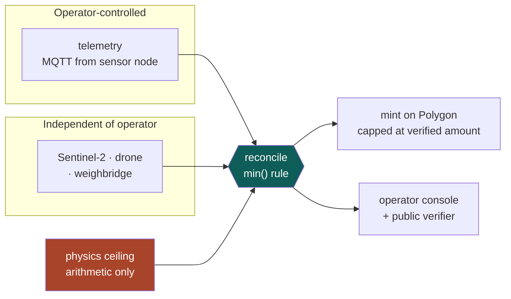

<div align="center">

# AlgaCarbon

**Making a carbon claim checkable.**

Verification platform for algae-based carbon sequestration.
Team **RunTimeZero** — HackOut'26, Circular Carbon Ecosystem.

</div>

---

## The problem

Algae eat CO₂ as they grow. If you can prove how much they ate, you can sell carbon credits.

**Nobody can currently prove it.** The farm operator reports their own numbers and the verifier has
no independent way to check them. That isn't a small gap — roughly **23%** of credits retired in the
voluntary market in 2024 were judged unlikely to deliver, and across a meta-analysis of nearly a
billion tonnes, **fewer than 16%** of credits from investigated projects represented real reductions.

Here's the part that shaped everything we built: **not one major carbon fraud involved a tampered
registry.** The records were accurate. The inputs were false.

## What we do about it

We compute a second estimate from evidence the operator cannot touch — satellite imagery, a public
weighbridge ticket, and the physics of how much sunlight landed on that pond — and then:

```
creditable = min(claimed, independent_lower_bound, physics_ceiling)
```

Claim 100 t with evidence for 100 t → you get 100 t.
Claim 150 t with evidence for 100 t → **you get 100 t.**
Claim above what physics allows → **rejected outright.**

The point isn't that we catch liars. It's that **lying gains you nothing** — there is no number an
operator can type that yields more credits than the evidence supports. Fraud stops being a risk to
detect and becomes a strategy with no payoff.

> We are not fixing the ledger. Ledgers were never the problem. We are fixing what gets written
> into one.

---

## How it fits together



**New here? Read [`docs/HOW-IT-WORKS.md`](docs/HOW-IT-WORKS.md).** It explains the whole system from
first principles and assumes nothing.

- [`docs/ARCHITECTURE.md`](docs/ARCHITECTURE.md) — diagrams of every feature and data path
- [`docs/DECISIONS.md`](docs/DECISIONS.md) — 11 decisions and why, including the ones we got wrong first
- [`docs/ONBOARDING.md`](docs/ONBOARDING.md) — setup for teammates new to the stack

---

## Quick start

Everything runs locally. No servers, no hosting, no cloud.

```bash
git clone https://github.com/Daksh2477/RunTimeZero.git
cd RunTimeZero
npm install
cp .env.example .env

createdb algacarbon && npm run db:setup    # 9 tables
npm run dev                                 # api :4000 · web :3000
```

Physics engine (Rust → WASM):

```bash
cargo test --manifest-path packages/physics/Cargo.toml   # 27 tests
npm run physics:build
```

Needs Node 22+, Postgres 16+, and Rust + `wasm-pack` if you're touching `packages/physics`.

---

## What's built

| | Status |
|---|---|
| Shared types + 9-table schema | ✅ |
| `solar.rs` — position, day length, clear-sky irradiance | ✅ 8 tests |
| `growth.rs` — Monod kinetics + Beer–Lambert self-shading | ✅ 10 tests |
| `ceiling.rs` — the physics bound | ✅ 9 tests |
| ESP32 firmware + Wokwi circuit | ✅ |
| `sim.rs` / `faults.rs` — the twin | ⬜ |
| MQTT ingestion → Postgres | ⬜ |
| Copernicus ingestion → NDCI | ⬜ |
| Reconciliation engine | ⬜ |
| Contracts on Amoy | ⬜ |
| Console · verifier · simulator | ⬜ |
| 4 ONNX models | ⬜ |

---

## The stack

**TypeScript** for the API, web and contracts tooling — one runtime to debug at 4am.
**Rust → WASM** for physics only: deterministic math that runs identically on the server and in the
browser, so the public simulator and the verification engine can't drift apart.
**Postgres** with raw SQL, no ORM. **Polygon Amoy** for credits. **ONNX** for models, so Python stays
a training-time dependency and never enters the request path.

### The hardware is simulated; the firmware is real

We have no ESP32. So rather than have the simulator write rows straight into Postgres, we built the
node: real Arduino firmware, real analog reads, real two-point calibration, publishing real MQTT over
Wokwi's simulated WiFi to a public broker. The API subscribes to that broker and has **no other
source of pond data**.

That means the reconciliation engine physically cannot see ground truth — the only thing crossing the
wire is a noisy, quantised sensor reading. It's the difference between *"we promise we didn't cheat"*
and *"we couldn't have."*

The circuit has potentiometers, so an evaluator can turn a knob and watch the dashboard move.

---

## Where the AI is

Four models — and **none of them decides how many credits get issued**. That stays arithmetic, so
there's nothing for an operator to dispute.

| Model | Job |
|---|---|
| `crash_classifier` | Culture collapse 24–48 h ahead — why an operator opens the app daily |
| `divergence_classifier` | Noise vs drift vs **systematic** overstatement across many windows |
| `yield_residual` | Site-specific shortfall against the physics forecast |
| `ndci_biomass` | Chlorophyll index → biomass, with a prediction interval |

The second one earns its place: the hard rule catches *impossible* claims, but a careful fraudster
sits just under the ceiling and overstates 8% every window. Each window passes. The pattern doesn't.

---

## Team

| | Owns |
|---|---|
| **Mahit** | `packages/types`, `packages/physics`, `packages/models`, `apps/api/src/reconcile`, `apps/contracts` |
| **Chetan** | `packages/physics/src/sim.rs`, `faults.rs`, `apps/firmware`, `scripts/seed.ts` |
| **Henil** | `apps/web` — operator console, components |
| **Daksh** | `apps/api/src/ingest`, `apps/web` — verify and sim pages |

Each person owns directories nobody else edits. Need something from someone else's area? Ask them to
expose it through `packages/types` rather than editing their files.

### Working agreement

Single branch — `main`. Commit after every meaningful change, pull before you start.

```bash
git pull --rebase
./scripts/commit.sh "add ndci parser"
./scripts/push.sh
```

1. Files stay **~150–250 lines**. Growing past that means it's doing two jobs — split it.
2. **No new dependencies** without asking.
3. **No `SELECT *`** in application code.
4. `async/await`, never `.then()` chains. No default exports except pages and components.
5. Comment the non-obvious **why**, never the obvious what.
6. Evidence tables are **append-only** — never `UPDATE`, never `DELETE`.
7. The reconciliation engine **must never** import from the simulator. See `docs/DECISIONS.md` #6.

CI runs `cargo test` and `tsc` on push. It deploys nothing.

---

## The pitch, in four sentences

1. An algae operator's carbon claim is currently just their word.
2. We compute a second estimate from evidence they don't control.
3. We credit the **lower** of the two, so overstating gains them nothing.
4. The engine never sees the truth, because the only thing reaching it crossed an MQTT wire.
