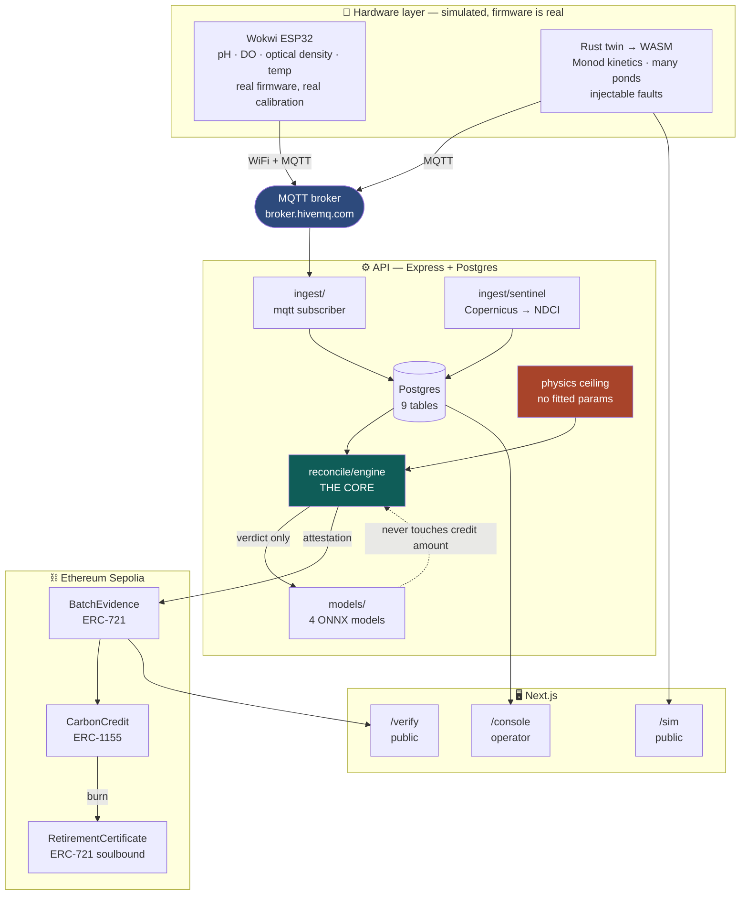
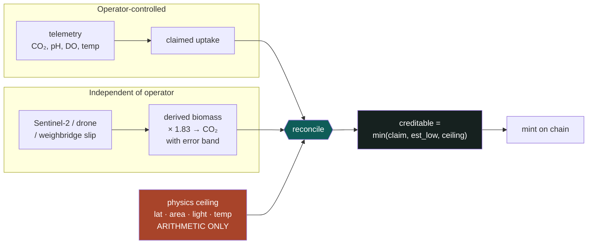
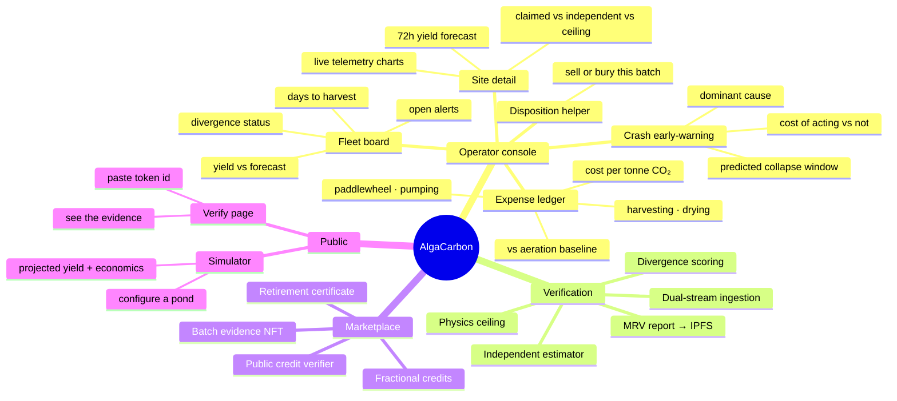
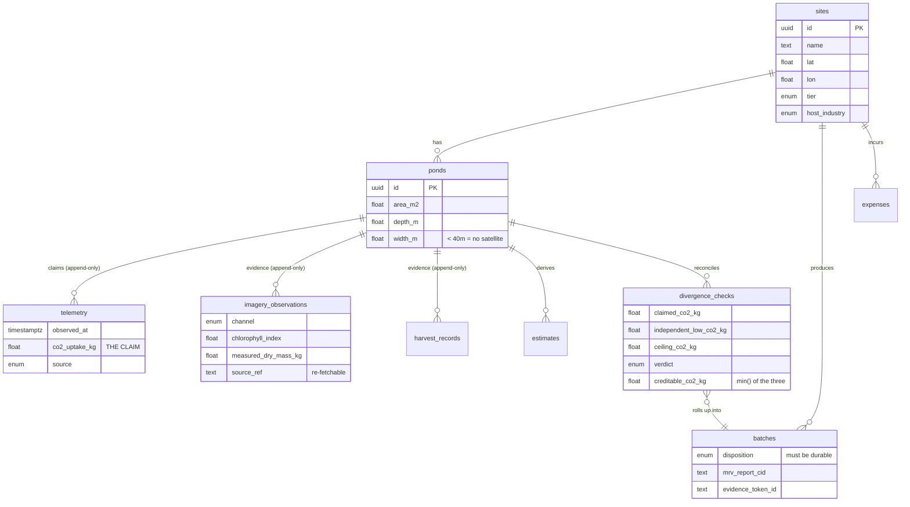
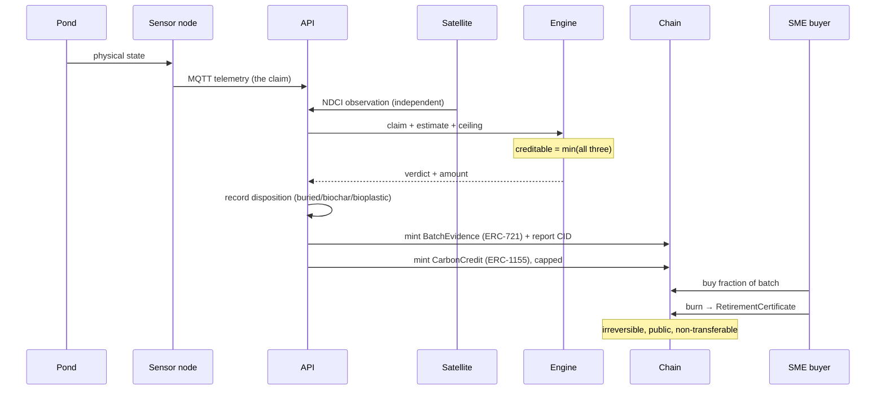

# AlgaCarbon — Architecture

Everything runs on one laptop. No servers, no cloud, no hosting. The only external calls are a free
weather API, a free satellite data API, a public MQTT broker, and a testnet RPC.

---

## 1. The whole system, end to end



**The one thing to notice:** there is no arrow from the twin into the API. Pond data reaches the
engine *only* by crossing an MQTT wire as a noisy, quantised sensor reading. That is what makes
"the engine never sees ground truth" a property of the wiring rather than a promise.

---

## 2. The verification mechanism

This is the product. Everything else is plumbing around it.



Three guards, in order of strength:

| Guard | Catches | Can it be argued with? |
|---|---|---|
| **Physics ceiling** | Physically impossible claims | No. It's orbital mechanics and pond area. |
| **min() rule** | Any overstatement above the evidence floor | No. It's arithmetic. |
| **Divergence classifier** | *Clever* fraud that stays under the ceiling | Yes — so it only sets the verdict, never the amount. |

The third one exists because a careful fraudster sits just under the ceiling and overstates by 8%
forever. Each window looks fine. The pattern doesn't.

---

## 3. Every feature, and where it lives



| Surface | Route | Who | Needs login |
|---|---|---|---|
| Operator console | `/console` | Pond operator | Yes |
| Public verifier | `/verify` | Anyone | No |
| Public simulator | `/sim` | Anyone | No |
| API | `:4000` | — | — |

---

## 4. Data model



Evidence tables are **append-only**. Never `UPDATE`, never `DELETE`. A later reading supersedes an
earlier one; the original stays. A verification system that can quietly rewrite its own inputs
verifies nothing.

---

## 5. Credit lifecycle



Step 7 — recording disposition — is the one most proposals skip. Without a durable outcome you've
certified *utilisation*, not removal, and the credit is invalid no matter how faithfully the chain
recorded it.

---

## 6. Repo map

```
runTimeZero/
├── packages/
│   ├── types/          shared TS types — the contract between everything
│   ├── physics/        Rust → WASM: solar, growth, ceiling, sim, faults
│   ├── models/         4 models: train in Python, run as ONNX in Node
│   └── chain/          contract ABIs + ethers bindings
├── apps/
│   ├── api/            Express + Postgres
│   │   └── src/{routes,services,ingest,reconcile,db}
│   ├── web/            Next.js: (console) (verify) (sim)
│   ├── firmware/       real ESP32 firmware, simulated board
│   └── contracts/      3 Solidity contracts
├── scripts/            commit.sh, push.sh, seed.ts
└── docs/               this file, DECISIONS.md, HOW-IT-WORKS.md, ONBOARDING.md
```

---

## 7. Why the stack is what it is

| Choice | Reason |
|---|---|
| **TypeScript nearly everywhere** | One runtime to debug at 4am, with three teammates learning as they go |
| **Rust → WASM for physics** | Deterministic math; compiled to WASM it runs *identically* server-side and in the browser, so the public simulator and the verification engine can't drift apart |
| **Raw SQL, no ORM** | An ORM is a second thing to learn and hides the query actually running |
| **npm workspaces, not pnpm** | Works with a bare Node install — one less setup step |
| **Copernicus statistics API** | Returns numbers, not GeoTIFFs. No raster processing at all |
| **Public MQTT broker** | Wokwi reaches it for free; no Wokwi Club subscription needed |
| **ONNX for models** | Train in Python offline, infer in Node. Python never enters the request path |
| **Ethereum Sepolia** | Every wallet and explorer supports it without adding a custom network, so a judge can click a transaction link and see it. Polygon Amoy is the better chain on merit — near-free gas, and tokenised carbon already lives on Polygon — and `hardhat.config.cjs` keeps it configured, but its faucet requires a mainnet ETH balance we are not going to fund for a testnet |

### Everything runs locally

| Component | Where | External dependency |
|---|---|---|
| API + Postgres | your laptop | — |
| Next.js | your laptop | — |
| Rust twin | your laptop | — |
| Models | your laptop, ONNX runtime | — |
| Wokwi node | browser | public MQTT broker |
| Weather | — | Open-Meteo (free, no key) |
| Satellite | — | Copernicus (free account) |
| Chain | — | Sepolia public RPC (free) |

CI runs `cargo test` and `tsc` on push. That's all it does. **It deploys nothing.**
