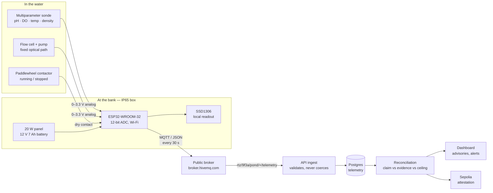

# The sensor node

What we would bolt to a pond, how it is wired, where it goes in the water, and
how a reading gets from a probe to a credit. The board in `apps/firmware` is a
real ESP32 sketch running on a simulated Wokwi board — the code is not a mockup,
only the pond is.

---

## The data path



The node publishes to a **public** broker, and the API trusts nothing it
receives: a malformed message is dropped and counted, a reading outside physical
range is dropped, and a claimed observation time more than an hour in the future
or 90 days in the past is dropped rather than quietly replaced with the time it
arrived. Anyone can publish to that topic — the protection is not the transport,
it is that no claim can exceed what photosynthesis allows.

---

## Wiring

Pins as they are in `apps/firmware/src/main.cpp`. ESP32 ADC is 12-bit over a
3.3 V reference, so every analog channel is `(raw / 4095) × 3.3`.

| Signal | Pin | Type | Notes |
|---|---|---|---|
| pH | GPIO 34 | ADC1 input-only | Two-point calibrated, pH 4 and pH 10 buffers |
| Dissolved oxygen | GPIO 35 | ADC1 input-only | Zero solution and air-saturated water |
| Optical density | GPIO 32 | ADC1 | 680 nm through a **fixed-path flow cell** |
| Water temperature | GPIO 4 | OneWire | DS18B20, waterproof probe |
| Paddlewheel running | GPIO 27 | digital, pulldown | Dry contact off the motor contactor |
| Transmit LED | GPIO 13 | digital out | Blinks on publish — the field diagnostic |
| OLED | GPIO 21/22 | I²C | SSD1306, so a farmer can read the pond without a phone |

GPIO 34 and 35 are input-only and on ADC1, which keeps working while Wi-Fi is
active. ADC2 pins do not, and that is the single most common way an ESP32 sensor
node fails silently.

### Calibration

```
pH        = 4 + (V − 0.40) × (10 − 4) / (2.80 − 0.40)
DO (mg/L) = (V − 0.10) × 6.25
OD        = V × 0.90
kWh       = contactor_hours × 0.5 W/m² × pond area
```

Two points per probe, the way a real one is set up — and the first thing to
suspect when a reading looks wrong. The 0.5 W/m² paddlewheel figure is shared
with `packages/physics` and the expansion planner: one number, one place.

### Optical density needs a flow cell

Reading turbidity through open water gives a value that tracks the sun, not the
culture. A small pump pushes pond water through a fixed-length cell at the bank,
the LED and photodiode sit either side of it, and the path length never changes.
Without this the density channel is decoration.

---

## Where the probe goes

A paddlewheel raceway is a mixed loop, which is the only reason one sonde per
pond is defensible. That holds only if it is sited properly:

| Rule | Why |
|---|---|
| Downstream of the paddlewheel, far straight from the inlet | Fresh influent is thinner, colder and differently buffered than the culture. A probe next to the inlet reads the effluent, not the pond. |
| Half the water depth — 0.12 m in a 0.25 m pond | The surface film superheats and supersaturates with oxygen by mid-afternoon; the floor collects settled biomass. Neither is the pond. |
| At least 1 m off the wall | Wall boundary layers are slow water, and slow water is not the loop. |
| Never in a corner out of the flow | A dead corner settles out and reads like a crashing culture. |

**How many.** One node per pond, not per hectare — and because a single
paddlewheel cannot mix beyond about 12,000 m², a bigger farm is more ponds
rather than bigger ones. That puts the ceiling at roughly one node per 1.2 ha.
One energy meter per site. One PAR sensor per site, since irradiance does not
vary across a few hectares.

**When not to instrument at all.** Below about 5,000 m² the sonde costs more
than the crop it protects. Those ponds are verified by weighed harvest, which is
cruder and much harder to dispute. `GET /land/site/:siteId/sensor-plan` returns
this per site with costs, so the figure on the dashboard is the figure in the
deck.

---

## Power

| Item | Draw |
|---|---|
| ESP32, Wi-Fi active | ~160 mA peak, ~80 mA average while publishing |
| Sonde | 12 V, ~30 mA continuous |
| Flow-cell pump | 12 V, ~200 mA, duty-cycled to the 30 s sample |
| OLED | ~15 mA |

A 20 W panel and a 12 V 7 Ah battery carry the node through roughly three
overcast days at a 30-second cadence. Gujarat's problem is not sunlight, it is
monsoon week — size for the monsoon, not the average.

---

## Cadence, and why 30 seconds

The models read the **day-night swing** in dissolved oxygen. A sunlit pond
supersaturates by afternoon and is stripped by dawn; a pond that stops swinging
has stopped photosynthesising, and that shows hours before density visibly
falls. It is the one leading indicator four probes can give us. Sample slower
than hourly and the swing disappears — which is exactly what happened when the
simulator rig published one reading per tick instead of one per simulated hour.

---

## What each failure looks like

| In the field | On the dashboard |
|---|---|
| Paddlewheel stops | Energy meter reads zero — unambiguous. Dissolved oxygen collapses overnight. Crash risk climbs. |
| Culture crashing | Density falls while pH drifts; the swing flattens first. |
| Probe drifts out of calibration | Readings stay smooth but leave the physical envelope; the ingest drops anything impossible. |
| Node loses Wi-Fi | Last-reading age climbs on the dashboard. Nothing is invented to fill the gap. |
| Someone publishes a fake reading | Accepted into telemetry as a *claim*, then refused by the ceiling — a claim above what the sunlight allows is not doubtful, it is impossible. |

---

## Running the board

```bash
cd apps/firmware
# Wokwi: open diagram.json in the VS Code extension, or wokwi.toml in CI.
pio run                     # build the real sketch
```

The three potentiometers in `diagram.json` stand in for the analog probes, the
slide switch for the paddlewheel contactor, and the DS18B20 is the temperature
probe as shipped. Turning a pot on the simulated board moves a number on the
live dashboard, through the same broker and the same validation as hardware
would.
