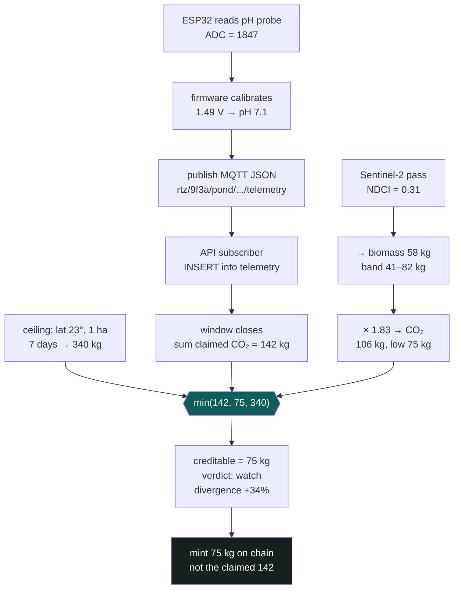

# How AlgaCarbon actually works

Read this once, top to bottom. It assumes nothing. By the end you should be able to explain the
whole system to a judge without notes.

---

## Part 1 — The problem, in three sentences

Algae eat CO₂ as they grow. If you can prove how much they ate, you can sell carbon credits.
**Nobody can currently prove it**, because the farm operator reports their own numbers and the
verifier has no way to check them.

That last sentence is the entire business.

---

## Part 2 — Why "just measure it better" doesn't work

The obvious fix is a better sensor. It fails for a reason worth internalising:

> **The sensor belongs to the operator.**

A CO₂ probe in the operator's pond, reporting to the operator's gateway, produces the operator's
number. Making that probe more accurate does not make it more *trustworthy*. If they want to
overstate, a better instrument just gives them a more precise lie.

This is why we don't measure CO₂ uptake at all. Our job is to **cross-examine** the number, not
produce it.

---

## Part 3 — The trick

You need a second number that the operator cannot touch.

We use three, in increasing order of how much you can rely on them:

**1. Satellite imagery.** Sentinel-2 photographs the pond from orbit every ~5 days, free. Chlorophyll
has a distinctive reflectance signature, so you can compute an index (NDCI) that tracks how much
algae is in the water. The operator cannot edit a satellite.

*Caveat that shaped the whole design:* NDCI needs a 20 m band, so a pond narrower than ~40 m is
smaller than the pixels. And even on big ponds NDCI has an error factor around 2.4 — it can be off
by more than double. **It cannot certify a quantity.**

**2. Weighbridge tickets.** When biomass is harvested it gets weighed. A mass on a public scale,
photographed with a timestamp, is crude — you get one number per harvest, not continuous data — but
it is very hard to forge quietly. For small operators this *is* the independent channel.

**3. Physics.** This one is free and absolute. Given a pond's latitude, area, and the date, you can
compute how much sunlight lands on it. Photosynthesis has a hard thermodynamic limit — roughly 8
photons per molecule of CO₂ fixed. So there is a maximum biomass that pond could possibly have
grown, and **no operator can exceed it**, ever, regardless of skill or equipment.

---

## Part 4 — Turning three weak signals into one strong rule

Here's the insight that makes the project work.

Satellite imagery is too imprecise to *measure* carbon. But you don't need it to measure. You need
it to **disagree**.

> Detecting that two numbers differ is a far weaker requirement than measuring either one exactly.

So the rule becomes:

```
creditable = min(claimed, independent_lower_bound, physics_ceiling)
```

Read that carefully. It means:

- Claim 100 t, evidence supports 100 t → you get 100 t.
- Claim 150 t, evidence supports 100 t → **you get 100 t.**
- Claim 500 t when physics allows 200 t → **rejected entirely.**

The important consequence isn't that we *catch* liars. It's that **lying gains you nothing.** There
is no number you can type that gets you more credits than the evidence supports. Fraud stops being a
risk to detect and becomes a strategy with no payoff.

That's the sentence to say on stage.

---

## Part 5 — Why the biomass number converts cleanly

One constant does a lot of work:

```
1 kg dry algal biomass  =  1.83 kg CO₂
```

Where it comes from: CO₂ is 44 g/mol, carbon is 12 g/mol, so carbon captured as CO₂ weighs 44/12 =
3.67× the carbon itself. Dry algal biomass is about 50% carbon. So 0.5 × 3.67 = **1.83**.

That's not an estimate or a model output — it's stoichiometry. Any judge can check it on paper.

---

## Part 6 — But growing algae isn't sequestration

This catches out most teams working on carbon.

If you grow algae and then eat it, burn it, or let it rot, **the carbon goes straight back into the
atmosphere**. A spirulina tablet sequesters nothing. You exhale it within days.

Carbon only counts as *removed* if it's durably stored:
- buried dry
- turned to biochar
- locked into long-lived bioplastic

So our contract refuses to mint unless the recorded disposition is one of those three. If the
biomass was sold as feed or fertiliser, that's **utilisation** — a delayed emission, not a removal —
and it gets no removal credit.

---

## Part 7 — Where the money actually is (and it isn't carbon)

Worth understanding, because it shapes who we sell to.

A 10-hectare pond facility costs roughly ₹80–230 L/year to run — dominated by **harvesting and
drying**, not by growing. Revenue from biomass, nutrients saved, and carbon comes to roughly
₹98–173 L.

At the pessimistic end, that loses money.

What makes it work is siting the pond on somebody's **wastewater**:

- The effluent supplies nitrogen and phosphorus **free** (otherwise a real cost)
- The host is **legally obliged** to treat that effluent anyway, and pays for it
- Conventional treatment blows air through tanks — aeration is **50–60% of a treatment plant's
  entire energy bill**. An algal pond oxygenates by sunlight instead.

So the pitch to a factory isn't "make money from carbon". It's *"treat your effluent cheaper, and
we'll prove the carbon as a by-product."* Carbon is the smallest revenue line — and the only one
that collapses to zero without verification, which is exactly why it's the line that needs software.

---

## Part 8 — Following one reading through the system



The operator claimed 142 kg. The evidence floor was 75 kg. **They got 75.** No argument, no appeal,
no model to dispute — just the smaller of two independently computed numbers.

---

## Part 9 — Where the AI fits (and where it deliberately doesn't)

Four models. **None of them decides how many credits get issued.**

| Model | Job |
|---|---|
| `crash_classifier` | Predicts culture collapse 24–48 h ahead. This is what makes an operator open the app daily. |
| `divergence_classifier` | Tells noise from drift from *systematic* overstatement across many windows |
| `yield_residual` | Learns how much a specific site under-performs its physics forecast |
| `ndci_biomass` | Maps chlorophyll index to biomass **with a prediction interval** |

Why the boundary matters: if a model set the credit amount, an operator could dispute the credit by
disputing our training data. Because it's arithmetic, there's nothing to dispute.

The `divergence_classifier` is the interesting one. The hard rule catches *impossible* claims. But
someone careful stays just under the ceiling and overstates 8% every single window. Each window
passes. The **pattern** doesn't. That's a genuine sequence-classification problem, and it's the right
answer when a judge asks "where's the AI?"

---

## Part 10 — Why the hardware is simulated but the firmware is real

We have no ESP32. The lazy move would be having the simulator write rows straight into Postgres and
calling them "sensor readings".

We didn't, for a specific reason.

If the twin and the verification engine live in the same process, they're one import away from each
other. Someone tired at 3am takes a shortcut, the engine ends up reading the true value, and
"detection" becomes the simulator reporting a number it already knew. The demo would prove nothing —
and a sharp judge would find it.

So instead: real Arduino firmware, running on a simulated ESP32 in Wokwi, publishing real MQTT over
a simulated WiFi stack to a real public broker. The API subscribes. That's its **only** source of
pond data.

Now the engine *cannot* see ground truth, because the only thing crossing the wire is a noisy,
quantised sensor reading.

> The difference between *"we promise we didn't cheat"* and *"we couldn't have."*

Bonus: the Wokwi circuit has potentiometers. A judge can drag a knob and watch your dashboard move.
People remember systems they touched.

---

## Part 11 — What to run, in order

```bash
npm install
createdb runtimezero && npm run db:setup     # 9 tables
npm run dev                                   # api :4000, web :3000
cargo test --manifest-path packages/physics/Cargo.toml   # 27 tests
npm run physics:build                         # Rust → WASM
```

Then open the Wokwi project, hit play, and watch telemetry arrive in `/console`.

---

## Part 12 — The four sentences that are the whole pitch

1. An algae operator's carbon claim is currently just their word.
2. We compute a second estimate from evidence they don't control — satellite, weighbridge, physics.
3. We credit the **lower** of the two, so overstating gains them nothing.
4. The engine never sees the truth, because the only thing reaching it crossed an MQTT wire as a
   sensor reading.

Everything in this repo exists to make those four sentences true.
